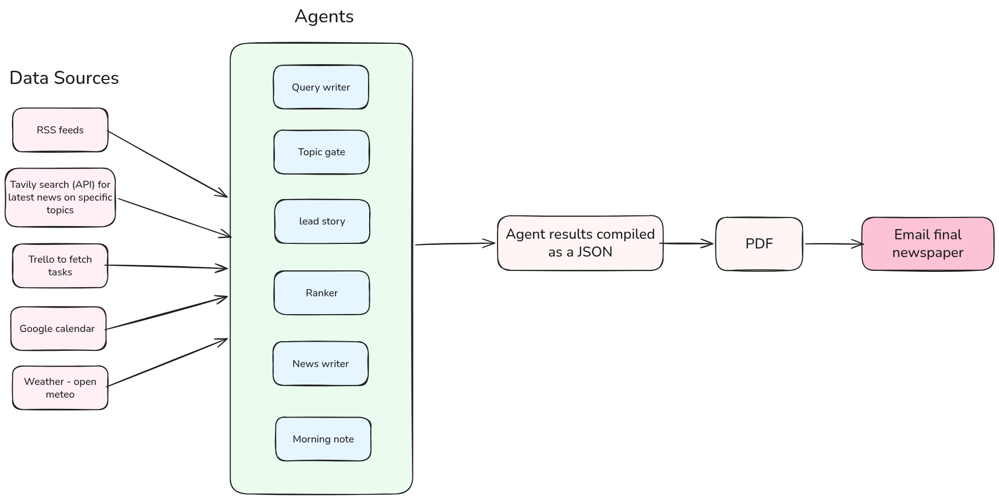

# Personalized Newspaper

Private morning newspaper. One program on this computer gathers the day’s news, your Trello board, and your calendar. A newsroom of agents writes the edition. Ordinary code prints an A4 PDF and can email it at **07:00 Asia/Karachi**.

Each agent has one job, one set of instructions, and a fixed answer form. Agents do not typeset or send mail. The same JSON always reprints the same PDF.

## How it fits together



A run takes a minute or so: **gather → choose → write → print → send**.

| Agent | Job |
| --- | --- |
| Query writer | 4 search queries per topic from `config/user.md` |
| Discovery | Guess one topic you never asked for, to try today |
| Topic gate × N | Keep the best 4 headlines on one beat |
| Front-page editor | Pick the one lead story |
| Beat ranker × N | Order the leftovers |
| Writer × one per story | Rewrite one story; no invented facts |
| Morning-note writer | Note from weather, meetings, and Trello |
| Weekly reflect | What is rising and fading; suggests `user.md` edits |

Five standing topics: Palestine, art and crafts, Islamabad culture, space, tech and AI. N is those five plus whatever discovery topics are in play, so a typical morning is about 36 calls.

## Setup

```
python3 -m venv .venv
source .venv/bin/activate
pip install -e ".[dev]"
sudo apt install texlive-latex-recommended texlive-latex-extra texlive-fonts-recommended
```

Python 3.11+ and `pdflatex` are required. Secrets go in `.env` at the repo root (gitignored), or in the environment:

| Name | Used for |
| --- | --- |
| `ANTHROPIC_API_KEY` | Newsroom calls |
| `OPENROUTER_API_KEY` | Meen, the chat assistant (`MEEN_MODEL` overrides `z-ai/glm-5.3-flash`) |
| `TVLY_API_KEY` | Search and article extract |
| `TRELLO_API_KEY` / `TRELLO_TOKEN` | The desk (board **Tasks**) |
| `GOOGLE_ICAL` | Secret calendar URL (today + tomorrow) |
| `GMAIL_APP_PASSWORD` | Gmail send: the 07:00 run, and Meen's email tool |

Paper name, send addresses, and Trello list names are in `config/paper.yaml`. Interests are in `config/user.md`. Do not commit keys.

## Commands

```
python -m src.cli preview            # gather, write the PDF, open it
python -m src.cli preview --sample   # reprint a saved example; no agents, no APIs
python -m src.cli send               # same as preview, then email the PDF
```

`preview` does not send mail. `--sample` is the layout check. Meen (below) runs that same code from the chat, and can email a printed edition afterwards.

Output lands in `editions/YYYY-MM-DD/` (JSON, TeX, PDF, images). Logs are in `logs/`.


If the machine is asleep at 07:00 Karachi, it sends on the next boot instead of skipping the day. The wrapper reads `.env`.

Trello or calendar can fail; the paper still prints with a note in that box.

## Taste tracker

Every story in the PDF ends with **more like this · less**. Clicking one saves the vote and shows a short desktop notification; no browser tab opens. Register the link handler once:

```
./scripts/install-vote-links.sh
```

Writers tag each story with 2–4 themes ("pakistani ceramics"), so the tracker can see what you like as well as which topic it came from.

```
python -m src.cli serve            # http://localhost:8765 : today's cards + "Your taste"
python -m src.cli taste backfill   # load older editions into the log
python -m src.cli taste reflect    # weekly report: what is rising, fading, and user.md suggestions
```

Printed stories and votes live in `data/taste.db` (gitignored). The charts and rising/fading lists are plain counting. Only the weekly report is written by an agent, and it waits for at least 10 votes. It suggests edits to `config/user.md` but never changes the file.

Keep the page server running and the report weekly:

```
cp scripts/rameen-taste.service scripts/rameen-reflect.{service,timer} ~/.config/systemd/user/
systemctl --user enable --now rameen-taste.service rameen-reflect.timer
```

### Meen

Every page of `serve` has a round avatar button at the bottom right that opens Meen, the newspaper assistant. Each turn she is told what the page is showing — story previews with their themes and your vote on each, or the taste page — and your interests from `config/user.md`. She can:

- **print today's paper** — the same run as `preview`, without opening the PDF viewer. The chat shows a timer and quips for about a minute, then the page reloads on the new edition. One run at a time: a second tab is told to wait.
- **email an edition** — sends an already-printed PDF to the address in `config/paper.yaml`. It never prints a new one, and never sends to an address given in chat.
- **read any edition** — today's or an older one, whatever page you are on.
- **report on your taste** — stories printed, liked and disliked per topic, plus rising and fading themes. Re-read from `data/taste.db` on every call.
- **edit `config/user.md`** — an exact find-and-replace, refused when the text appears more than once.

Chats are remembered per browser tab until the server restarts. The pencil icon starts a fresh conversation, the arrows expand the panel to full screen, and Escape steps back one level.

To change her face, replace `src/web/meen.jpg`. Any square image works, and `.png`, `.gif` or `.webp` are served just as happily — keep one `meen.*` file in that folder.

The server listens on 127.0.0.1 only and has no login; do not expose the port.

### Something new

Each morning one extra topic you never asked for runs in a **Something new** box after the lead. An agent guesses it from `config/user.md` and an optional profile:

```
cp config/profile.example.yaml config/profile.yaml   # birthday, location, education, hobbies…
```

`profile.yaml` is gitignored, and only the discovery agent reads it. Your vote on the trial story decides the topic the next morning:
- **more** keeps it as a standing topic (at most 3; a 4th waits for a free slot)
- **less** means it is never suggested again
- no vote lets it go for now; it may come back after 90 days

Kept topics run on search only (no RSS) with a lead and one brief. The **Your taste** page lists every trial, kept and rejected topic, with Drop / Swap in / Undo buttons.
