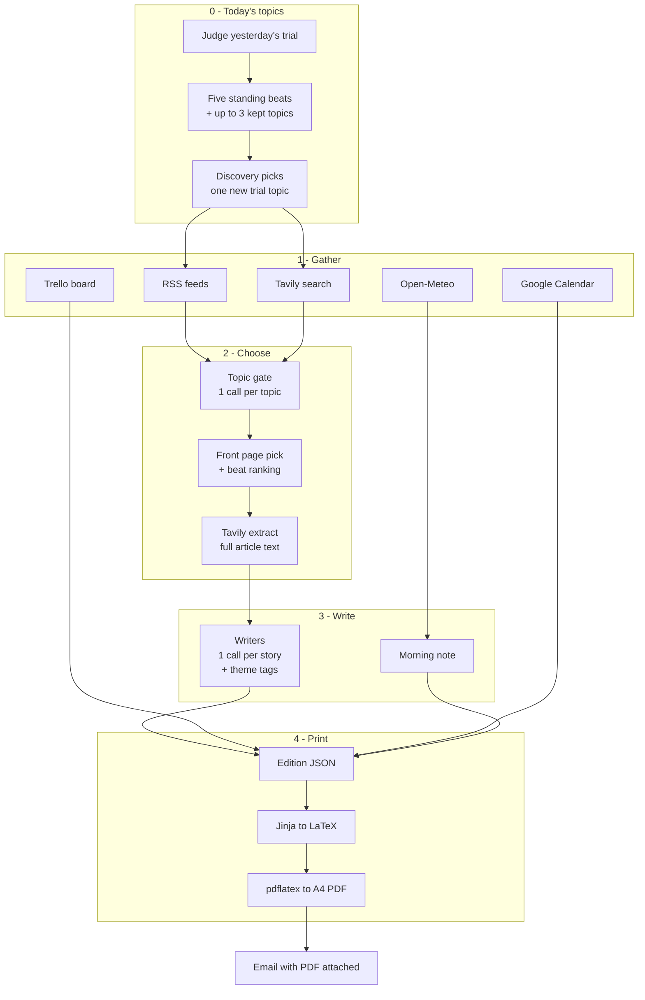
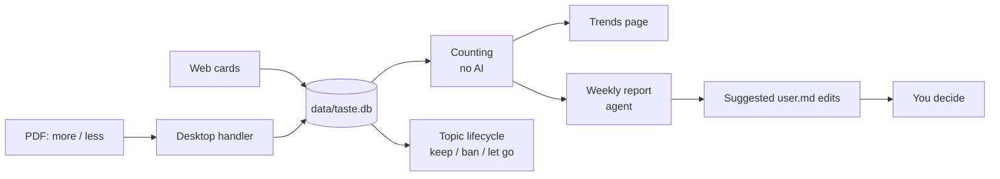
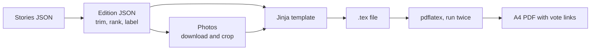

# The Rameen Times — How It Works

*Last updated: 2026-09-22*

The Rameen Times is a program that prints a personal newspaper every morning. It
gathers the day's news, your meetings and your task list, has a small team of AI
agents write the stories, lays them out as a real newspaper page, and emails you
the PDF at 07:00 Karachi time.

It also learns. Every story in the paper carries a **more like this / less** link.
One click records what you thought, and over weeks the paper works out what you
actually read — and tries one new topic a day that you never asked for.

This document describes the system **as it actually runs**. `project.md` is the
original specification and still describes an earlier design in places.

---

## The problem

Every morning the same information is scattered across five news sites, a
calendar, a task board and a weather app. Most of it is noise, and the apps that
do the choosing optimise for clicks, which pulls towards outrage and celebrity.

Two deeper problems shaped this project:

1. **Nothing learns from what you read.** Interests are written once, by hand, in
   a file. If your taste moves, the paper never finds out.
2. **You only ever get what you already asked for.** List five topics and you see
   five topics forever. A system built only on your own choices can never show
   you something genuinely new.

The first three stages of this document solve the daily paper. The last two —
the taste tracker and discovery — solve those two problems.

---

## How one morning works

One command runs the whole thing, and it always goes in the same order:
**gather, choose, write, print, send**. A single run takes about a minute and
makes roughly 35 agent calls.



Read it top to bottom: the day's topics are settled first, the sources all feed a
filtering stage, the survivors are written up one story at a time, and everything
merges into a single JSON file that becomes the printed page.

The important design choice is that **JSON is the hand-off point**. Every
decision about what goes in the paper is finished before layout begins, and
nothing after that point asks an agent anything. That makes printing repeatable:
the same JSON always produces the same PDF, so a layout problem can be fixed and
re-run without spending money on the model or hitting the news sites again.

**Where this lives.** `src/pipeline.py` is the conductor: `build_state()` runs
stages 0 to 2, `compose()` runs stage 3. `src/cli.py` `main()` then calls
`write_edition()` for stage 4 and `_send()` for stage 5.

---

## The newsroom

The paper is not written by one big prompt. It is written by a small crew of
separate agents, each with one job, one set of instructions, and a fixed answer
shape.

| Agent | Runs | Its one job |
| --- | --- | --- |
| Query writer | once | Reads your interests file and writes 4 search queries per topic |
| Discovery | once | Guesses one topic you have never asked for |
| Topic gate | once per topic | Sees ~40 headlines for one topic, keeps the best 4 |
| Front page pick | once | Chooses which single story leads the paper |
| Beat ranking | once per topic | Orders the leftovers for each topic |
| Writers | once per story | Rewrites one article, and tags it with themes |
| Morning note | once | Writes your personal note from weather, meetings and tasks |
| Reflect | weekly | Says in plain words how your taste is shifting |

Splitting the work this way buys three things.

**A failure stays small.** If one writer fails, that story is dropped and the
paper still prints.

**The expensive model is used only where judgement matters.** The more capable
model decides what is worth reading, which new topic to try, and what your votes
mean. The faster model does the writing. Judgement is the hard part; producing
2,000 readable characters is not.

**Every call is checked.** Each agent is handed a required answer shape and must
reply by filling in that form rather than writing free text. If the reply does
not fit the form, the code sends it back once with the error attached. If it
fails twice, that agent falls back to a plain non-AI rule, such as "keep the top
4 by source preference". The paper is never blocked by a model having a bad
moment.

One deliberate limit: agents may only choose among stories that the gathering
code actually found. They rank, pick and rewrite, but they cannot introduce a
story, a quote or a source of their own. That is the main defence against
invented news.

**Where this lives.** Every agent is one file in `src/agents/`: `queries.py`,
`discover.py`, `gate.py`, `briefing.py` (front page and ranking), `stories.py`
(writers and the morning note) and `reflect.py`. Each file holds its own prompt
as a `SYSTEM` constant, its agent function, and its plain-rule fallback next to
it — for example `gate.py` has `gate_topic()` and `fallback_picks()` a few lines
apart, so you can always see what happens when the model fails.

The shared caller is `src/agents/llm.py` `complete_json()`: it sends the required
answer shape, validates the reply, retries once with the error attached, and
raises if the second try also fails. The answer shapes themselves are the classes
in `src/models.py` (`TopicGateOut`, `LongDraft`, `DiscoveryPick`, `TasteReport`
and the rest).

---

## Where the news comes from

The paper covers five fixed topics — Palestine, art and crafts, Islamabad
culture, space, tech and AI — plus any topic discovery has added. Your taste for
each one lives in a plain English file, `config/user.md`, which you edit by hand.
The program only reads it.

News arrives on two roads at once:

- **RSS feeds** — a fixed list of publications in `config/feeds.json`, newest 5
  items each. Reliable, but only covers outlets already on the list.
- **Tavily search** — a news search API. An agent reads your interests file and
  writes 4 fresh queries per topic each morning, so this road finds things no
  fixed feed would.

That yields roughly 200 candidate headlines. Four filters then cut it to about 20:

1. **Already seen.** Every story printed in the last 45 days is remembered in
   `data/seen.json`, by both link and headline, so the same story cannot appear
   twice under a reworded title.
2. **Blocked sources and keywords.** Dawn and Tribune are dropped as house
   voices. The Islamabad topic additionally drops anything political or
   security-related by keyword, so the culture page stays a culture page.
3. **The topic gate.** An agent sees one topic's surviving headlines and keeps
   the best 4, judged against your interests file.
4. **Photo check.** Stories without a usable picture are weaker candidates, and
   Instagram and Facebook image links are rejected outright because they do not
   load for an outside program.

Only after the cut does the program fetch full articles, using Tavily's extract
endpoint on the ~20 survivors. That ordering is a cost decision: full text is
fetched for the stories that made it, not for the 200 that did not.

The writers work from that extracted text. They are told to rewrite it, never to
paste it, and never to invent a quote, a death toll or a diplomatic development.
Each printed story carries its source name.

**Where this lives.**

| Piece | File |
| --- | --- |
| Feed fetching and parsing | `src/gather/news.py` `gather_news()`, `parse_feed()` |
| The four filters | `src/gather/news.py` `select_candidates()`, `should_drop()` |
| 45-day repeat memory | `src/seen.py` `is_seen()`, `remember()`, `KEEP_DAYS` |
| Blocked sources, Islamabad keywords | `src/gather/news.py` `BLOCKED_HOSTS`; `src/config.py` `ISLAMABAD_DROP` |
| Topic definitions and feeds | `src/config.py` `TOPIC_SPECS`, `load_topics()`; `config/feeds.json` |
| Search and full-text extract | `src/gather/tavily.py` `search()`, `fill_extracts()` |
| Daily search queries | `src/agents/queries.py` |
| The topic gate | `src/agents/gate.py` `gate_topics()` |
| Front page and ranking | `src/agents/briefing.py` `pick_headline()`, `rank_topic()` |
| Finding a photo when a story has none | `src/gather/images.py` `ensure_image()` |

---

## Your day: Trello, calendar and weather

The right-hand column of page one is the personal half of the paper. Three
services feed it, and each connects differently.

| Source | How it connects | What it needs |
| --- | --- | --- |
| Trello | REST API, key + token | `TRELLO_API_KEY`, `TRELLO_TOKEN` |
| Google Calendar | Secret iCal link, downloaded as a file | `GOOGLE_ICAL` |
| Weather | Open-Meteo, free, no account | nothing |

**Trello** is read over its normal API. The program finds your board by name,
then sorts its lists into two buckets set in `config/paper.yaml`: lists like
*this week* and *later* become To-do, lists like *today* become In progress.
Matching ignores capitals. If no list names match, it falls back to reading every
list rather than printing an empty box.

**Google Calendar** uses the secret iCal link from your calendar settings rather
than a Google sign-in: the program downloads one file, with no login flow and no
token that expires. It then does real calendar work on that file — expanding
repeating events into actual dated ones, honouring end dates, skipping cancelled
events, and converting everything to Karachi time. It shows today and tomorrow.

**Weather** comes from Open-Meteo for Islamabad, which needs no account. The raw
response is large, so the code reduces it to the handful of numbers actually
printed.

All three are optional by design. **If any one of them fails, the paper still
prints.** A failed service writes a short note in place of its box — "Trello not
connected" — and the run carries on.

**Where this lives.** `src/gather/trello.py` `gather_trello()`,
`src/gather/calendar.py` `parse_ics()` (the repeat-expansion and timezone work),
and `src/gather/weather.py`, which loads `scripts/islamabad_weather.py`. The
list-name buckets are read from `config/paper.yaml`.

---

## The taste tracker

A PDF is normally a dead end: you read it, and nothing comes back. Without
feedback the paper cannot learn anything, so the first job was to capture a
signal without adding a chore.

### What counts as a signal

It is tempting to treat "stories the paper showed you" as taste data. It is not.
The paper chose those stories, so counting them only reflects its own choices
back at itself. Shown stories are useful as the denominator — how many chances
did a topic get — and nothing more. The real signal has to come from you.

### How a vote is captured

Every story in the PDF ends with small **more like this · less** links. Clicking
one hands a private link type, `rameen-vote://`, to a small handler registered on
your desktop (`src/taste/votelink.py`, installed by
`scripts/install-vote-links.sh`). The handler writes the vote straight into the
database and shows a short notification. No browser tab opens, and the web server
does not even need to be running.

There is also a card view of the same stories at `http://localhost:8765`, with
the same two buttons, for voting at a screen instead.



### What is stored

Three tables in one SQLite file, `data/taste.db`:

| Table | What it holds |
| --- | --- |
| `stories` | Every story ever printed: date, topic, source, headline, theme tags |
| `votes` | Your votes, with timestamps; the newest vote per story wins, so you can change your mind |
| `topics` | Discovery topics and their status: on trial, kept, waiting, rejected, let go |

### Theme tags

When a writer rewrites a story it also returns **2–4 short tags** for what the
story is actually about — "sourdough fermentation", "gaza bureaucracy",
"open-weights models". This costs nothing extra, because it happens inside a call
that was being made anyway, and it is what lets the tracker say something sharper
than "you like art".

**Where this lives.**

| Piece | File |
| --- | --- |
| Tables and all reads/writes | `src/taste/db.py` — `SCHEMA`, `record_edition()`, `vote()`, `stories_with_votes()` |
| "Newest vote wins" | `src/taste/db.py` `LATEST_VOTES` (the SQL that keeps only each story's last vote) |
| The PDF click handler | `src/taste/votelink.py` `parse()`, `record()`; installed by `scripts/install-vote-links.sh` |
| The link text in the PDF | `src/render/tex.py` `vote_links()`, `trial_links()`; macros `\votelinks` / `\triallinks` in `templates/edition.tex.j2` |
| The vote URL itself | `src/config.py` `VOTE_SCHEME`, `VOTE_BASE` |
| Web cards and buttons | `src/web/app.py` `page_day()`; `templates/web/day.html` |
| Theme tags | asked for in `src/agents/stories.py` `LONG_SYSTEM` / `BRIEF_SYSTEM`, cleaned by `_clean_themes()` in `src/models.py` |
| Logging what was printed | `src/cli.py` `record_taste()` |

---

## How the trends work

**There is no AI in the trend numbers, on purpose.** Counting and arithmetic give
the same answer every time, can be explained on a slide, and cannot quietly
invent a number. An agent doing the maths could be wrong in a way nobody would
notice. All of this lives in `src/taste/trends.py`.

### Like rate, and why it is smoothed

For each week and topic the code counts stories shown, liked and disliked, then
computes a like rate:

```
like rate = (liked + 1) / (shown + 2)
```

The `+1` and `+2` matter. Without them, a week where one story ran and got one
like reads as a perfect 100%, and the chart is dominated by noise. The adjustment
pulls thin weeks towards the middle until there is enough evidence to move them.

### Rising and fading themes

Every voted story carries its theme tags. Each theme scores **+1 for a like and
−1 for a dislike**, and the code compares the **last 4 weeks with the 4 weeks
before**.

An example of what that catches:

| Theme | Earlier 4 weeks | Last 4 weeks | Reading |
| --- | --- | --- | --- |
| galleries | +2 | −1 | fading |
| ceramics | 0 | +2 | rising |

The topic — art and crafts — did not change at all. What moved was the kind of
story inside it: away from gallery write-ups, towards hands-on craft. A
topic-level count could never see that.

### Why not embeddings

The textbook approach is to turn each story into a vector, average the liked ones
into a "taste vector", and measure how far it drifts. This project does not, for
three reasons:

- it needs a second vendor or a large local model, for one reader and about 20
  stories a day
- a drift score of "0.83" is not something you can act on or explain
- the theme tags already give the same insight, in words

If tags ever prove too coarse, embeddings can be added later without changing
anything else.

### The weekly report

The numbers say *that* something shifted. They cannot say *what it means*. So
once a week one agent receives the vote counts, the rising and fading themes,
your most-liked and most-disliked headlines and your current interests file, and
writes:

- a short plain-English summary
- rising and fading themes, each with the evidence it used
- **suggested edits to `config/user.md`**

Two rules keep this honest. It waits until there are **at least 10 votes**,
because below that any "trend" is noise. And it only ever suggests: **you** edit
the file. The loop deliberately closes through a human.

**Where this lives.**

| Piece | File |
| --- | --- |
| The smoothed like rate | `src/taste/trends.py` `like_rate()` |
| Weekly topic counts | `src/taste/trends.py` `weekly_topics()`, `week_of()` |
| Rising and fading | `src/taste/trends.py` `theme_shift()`, with `WINDOW = 28` days |
| All-time theme tally | `src/taste/trends.py` `top_themes()` |
| Everything the page and agent read | `src/taste/trends.py` `summarize()` |
| The weekly agent | `src/agents/reflect.py` — `SYSTEM`, `reflect()`, `MIN_VOTES = 10`, `fallback_report()` |
| Running it, saving it | `src/cli.py` `_reflect()`; `src/taste/db.py` `save_report()` |
| The charts and tables | `templates/web/trends.html`; data prepared by `src/web/app.py` `page_trends()` |

---

## Something new: discovery topics

The taste tracker can only confirm topics you already chose. Discovery is what
lets the paper find topics you did not know to ask for.

Each morning one extra topic runs in a clearly-marked box after the lead story.
An agent guesses it from your interests file and an optional profile in
`config/profile.yaml` (birthday, which becomes an age; location; education;
hobbies). The file is gitignored and only this agent reads it.

A real example from the running system:

> **Something new · Food science & fermentation**
> *We guessed you might like food science and fermentation. You bake and love
> chemistry, so the lab side of dough, yeast and fermentation seemed like a
> natural next bench to lean over.*

The prompt has guard rails: adjacent but genuinely new, not a sub-topic of an
existing beat; concrete enough to have news this week; nothing political or
security-related; and **age and gender are weak hints at most, never
stereotypes**. Separately, the code refuses any topic that duplicates one you
already read or rejected, and asks again.

Your vote on that one story decides the topic's future:

| Your vote | What happens |
| --- | --- |
| **more** | It becomes a standing topic (up to 3 kept; a 4th waits for a free slot) |
| **less** | It is never suggested again |
| no vote | Let go for now; it may come back after 90 days |

A kept topic then behaves like any other section, with a lead and one brief each
day. It runs on search only, because a brand new topic has no curated feed list.
A trial topic is never allowed to lead the paper — it is an experiment, and the
box says so.

**Where this lives.**

| Piece | File |
| --- | --- |
| The guessing agent and its guard rails | `src/agents/discover.py` — `SYSTEM`, `discover_topic()` |
| The required answer shape | `src/models.py` `DiscoveryPick` (slug pattern, exactly 4 queries) |
| The profile, and age from birthday | `src/config.py` `load_profile()`, `age_on()`; `config/profile.example.yaml` |
| Choosing today's topics | `src/pipeline.py` `discovery_topics()` |
| The lifecycle rules | `src/taste/db.py` `resolve_trials()`, `start_trial()`, `trial_for()`, `set_topic()` |
| The limits | `src/taste/db.py` `MAX_ADOPTED = 3`, `SKIP_COOLDOWN_DAYS = 90`, `excluded_slugs()` |
| Kept topics as real sections | `src/taste/db.py` `adopted_interests()`; `Interest.kind` in `src/models.py` |
| Fewer briefs for new topics | `src/agents/stories.py` `BRIEF_LIMITS` |
| Trials never lead | `src/agents/briefing.py` `build_briefing()` (the `front_pool` line) |
| The box in the paper | `src/render/edition.py` `_trial_note()`, `TRIAL_LIMIT`; `trial_box()` macro in `templates/edition.tex.j2` |
| Keep / drop / undo buttons | `src/web/app.py` `_topic()`; `templates/web/trends.html` |

---

## From JSON to a printed paper

The paper is typeset with LaTeX, the same tool used for academic papers and
books. An earlier version tried to send the newspaper as an HTML email; Gmail
clipped it and broke the images. Printing a PDF sidesteps email formatting
entirely.



Five things happen on the way that are worth knowing:

- **Length is capped.** The writers are asked for about 2,000 characters and
  regularly return 3,000. Left alone, sixteen stories ran to fifteen pages.
  Stories are trimmed on whole-paragraph boundaries — lead 2,100 characters,
  secondary 1,500, trial 1,100, brief 420 — which never leaves half a sentence.
- **Photos are downloaded and cropped by the program**, never linked. Each slot
  has a shape (the front-page photo is wide, inside ones shallow, the trial box
  4:3) and the image is cut to fit exactly, so no picture arrives with blank
  space beside it.
- **Text is made safe for the typesetter.** LaTeX treats `&`, `%` and `$` as
  commands, so they are escaped. More awkwardly, the typesetter cannot print
  emoji or Arabic at all — it stops with an error rather than skipping them. A
  model once put a sun emoji in the morning note and killed the whole run. Such
  characters are now converted where there is a sensible equivalent and dropped
  where there is not, with a line in the log saying what was removed.
- **Vote links are added** after each story's source line, and in the trial box
  they are worded as the decision they make: *more: keep this topic*.
- **pdflatex runs twice**, because page numbers in the contents box are only
  known after a first pass.

Every run is archived under `editions/YYYY-MM-DD/` — the JSON, the `.tex`, the
PDF and the photos — so an old edition can be reprinted at any time without
re-fetching anything. The email itself stays plain: the date, the lead headline,
and "paper attached".

**Where this lives.**

| Piece | File |
| --- | --- |
| Stories into a printable edition | `src/render/edition.py` `stories_to_edition()` |
| Length caps and whole-paragraph trimming | `src/render/edition.py` `BODY_LIMITS`, `TRIAL_LIMIT`, `trim_body()` |
| Photo download, crop shapes | `src/render/tex.py` `cache_image()`, `crop_to_ratio()`, `HERO_RATIO` / `SIDE_RATIO` / `TRIAL_RATIO` |
| Escaping, emoji and Arabic | `src/render/tex.py` `tex_escape()`, `_unicode_char()`, `report_dropped()` |
| Filling the template | `src/render/tex.py` `prepare_edition()`, `render_tex()` |
| The page design | `templates/edition.tex.j2` |
| Running pdflatex twice | `src/render/pdf.py` `compile_pdf()` |
| The email | `src/deliver/smtp.py` `send_pdf()` |

---

## Where AI is used, and where it is not

**Agents do judgement and language:**

- choosing which headlines are worth your morning
- picking the front page
- rewriting articles in the paper's voice
- tagging each story with themes
- guessing a new topic from who you are
- explaining, weekly, what your votes add up to

**Plain code does facts and arithmetic:**

- fetching, de-duplicating and filtering
- recording votes
- all counting, all charts, all rising and fading maths
- trimming, typesetting, photo cropping, emailing
- the topic lifecycle rules (keep, ban, let go, cooldown)

The principle: use the model where the answer is a judgement call and a small
mistake is survivable; keep it away from anything where being exactly right
matters and a wrong answer would be invisible. And no agent edits your config
file — it proposes, you decide.

**Where this lives.** The split is visible in the folder layout: every model call
is inside `src/agents/`, and nothing else in the codebase imports
`complete_json`. `src/taste/trends.py`, `src/taste/db.py`, `src/render/` and
`src/gather/` contain no AI at all.

---

## Tech stack, and why

| Layer | Choice | Why |
| --- | --- | --- |
| Language | Python 3.11+ | Fits the libraries; the whole system is ~5,000 lines |
| Data shapes | Pydantic | Defines what a story, meeting or edition must be. Agent replies are validated against it, so a malformed answer cannot reach the page |
| Network | httpx, async | Every source is fetched at once, so a run is a minute rather than five |
| Feeds, calendar | feedparser, icalendar, recurring-ical-events | Real calendar work: repeats, end dates, cancellations, timezones |
| Typesetting | LaTeX (pdflatex) | Genuine newspaper typography: columns, drop caps, photo boxes |
| Templating | Jinja2 | The whole design lives in one template file; changing the look never touches Python |
| Images | Pillow | Download and centre-crop each photo to its slot's exact shape |
| Taste storage | SQLite | One file, no server, transactional, already in Python |
| Web page | Python's built-in `http.server` | One reader, one laptop, a few pages: the standard library does it with no new dependencies |
| Charts | Chart.js from a CDN | No build step, no npm |
| Scheduling | systemd user timers | Already on the machine, timezone-aware, and a missed morning runs on the next boot |
| Tests | pytest | 132 tests, about 5 seconds |

Two deliberate non-choices are worth stating out loud, because both were the
obvious thing to reach for:

- **No web framework.** FastAPI would have added dependencies and a server
  process for something the standard library already does.
- **No embeddings.** Explained above: a second vendor and an unexplainable number,
  for a problem that tags already solve.

**Where data lives:**

| Place | What |
| --- | --- |
| `editions/YYYY-MM-DD/` | One folder per day: JSON, `.tex`, PDF, photos |
| `data/taste.db` | Stories, votes, topics, reports |
| `data/seen.json` | The 45-day memory that stops repeats |
| `logs/` | Every run, including each agent's prompt and reply, with keys blanked out |
| `config/` | What you edit: interests, feeds, paper settings, profile |

---

## What each part of the code does

| Folder or file | What it does |
| --- | --- |
| `config/` | The settings you edit: interests, RSS feeds, paper name, Trello lists, profile |
| `src/gather/` | Fetching only: news, search, Trello, calendar, weather, photos |
| `src/agents/` | Every agent call, plus the shared caller `llm.py` with its retry and validation |
| `src/taste/` | `db.py` storage and topic lifecycle, `trends.py` the maths, `votelink.py` the PDF click handler |
| `src/render/` | Finished stories into a PDF: trimming, LaTeX text, photo cropping, pdflatex |
| `src/web/` | The local page: today's cards, trends, topic buttons |
| `src/deliver/` | Gmail, plain note with the PDF attached |
| `src/pipeline.py` | The conductor — runs the stages in order |
| `src/cli.py` | The commands you type |
| `src/models.py` | The shape of every piece of data, and the rules each must satisfy |
| `templates/edition.tex.j2` | The newspaper layout itself |
| `templates/web/` | The pages of the local site |

Two of these carry more weight than their size suggests. `src/models.py` defines
what everything is, and because agent replies are checked against it, it is also
what stops a malformed answer reaching print. `templates/edition.tex.j2` is the
paper's entire visual design.

The 132 tests map onto the same split:

| Test file | Covers |
| --- | --- |
| `tests/test_news.py`, `test_tavily.py` | Feed parsing, filters, search |
| `tests/test_gate.py`, `test_chief.py`, `test_stories.py`, `test_prompts.py` | Agent picking, writing and fallbacks |
| `tests/test_trello.py`, `test_calendar.py`, `test_weather.py` | Your-day sources |
| `tests/test_edition.py`, `test_tex.py`, `test_layout.py`, `test_pdf.py` | Trimming, escaping, cropping, compiling |
| `tests/test_taste.py` | Store, votes, trend maths, weekly report |
| `tests/test_discovery.py` | Profile, guessing, topic lifecycle, the trial box |
| `tests/test_votelink.py` | The PDF click handler |
| `tests/test_web.py` | Page routes, voting, topic buttons |

---

## Running it

```
python -m src.cli preview            # build today's paper and open the PDF
python -m src.cli preview --sample   # re-print a saved example, no APIs called
python -m src.cli send               # build it, then email the PDF
python -m src.cli serve              # the local page on http://localhost:8765
python -m src.cli taste backfill      # load older editions into the taste log
python -m src.cli taste reflect       # write the weekly taste report
```

`--sample` is the one to reach for when changing the layout: it prints from a
saved file, so it costs nothing and needs no internet.

**Background services.** Three systemd user units, plus one desktop handler:

| Unit | When | What |
| --- | --- | --- |
| `rameen-times.timer` | daily 07:00 Karachi | Builds and emails the edition |
| `rameen-taste.service` | always on | Serves the local page |
| `rameen-reflect.timer` | Sundays 08:00 | Writes the weekly taste report |
| `scripts/install-vote-links.sh` | once | Registers the `rameen-vote://` click handler |

The timezone is named in the timer, so the edition lands at 07:00 Karachi
whatever the machine's clock is set to, and a missed morning (laptop asleep)
sends on the next boot instead of being skipped.

**Requirements.** Python 3.11 or newer, and a LaTeX installation for `pdflatex` —
on Debian or Ubuntu, `texlive-latex-recommended`, `texlive-latex-extra` and
`texlive-fonts-recommended`.

**Secrets.** Five values live in a `.env` file at the project root, which is
excluded from version control: the model API key, the Tavily key, two Trello
values and the Gmail app password, plus the secret calendar link. Personal
details live in `config/profile.yaml`, also excluded. Nothing is hardcoded, and
the logs redact keys.

Every run writes a full log to `logs/`, including each agent's prompt and reply.
When a paper looks wrong, that log shows which agent decided what.

---

## How this would scale

Today this is a single-user tool that runs on one laptop, with no servers and no
hosting bill. The only cost is API usage. Turning it into a product would mean:

| Now | At scale |
| --- | --- |
| Settings in files on one laptop | Per-user settings in a proper database |
| SQLite | Postgres, one set of rows per user |
| Runs on your machine | A worker queue building thousands of editions in a nightly window |
| A local page, no login | A web app with accounts |
| PDF by email | Email plus a mobile-friendly reader |

**The economics, and the key insight.** One edition costs about 35 model calls
and 40 searches. Multiplied by 10,000 readers that is ruinous — but most of that
work is *identical for any two readers who share a topic*. Gather Palestine news
once, write each story once, and the per-reader cost collapses to the
personalisation: selecting and ordering for that person, plus their own discovery
topic. **Shared work scales with the number of topics; per-reader work scales
with the number of readers.** Getting that split right is the difference between
a business and a hobby.

Other levers: cache gate decisions across readers on the same topic, keep the
expensive model for judgement and a cheaper one for writing, and batch the work
overnight.

**Where the value accumulates** is not the code — it is a few thousand lines —
but the taste history. A reader with six months of votes has a paper nobody else
can reproduce. The same data improves with scale: once many readers have voted, a
new reader's discovery guesses can be seeded from what worked for similar
readers, instead of starting cold.

**Risks to name first:**

- **Copyright.** Rewriting other outlets' articles is fine for one private
  reader; a commercial product needs licensing deals or a link-out model. This is
  the biggest commercial question.
- **Privacy.** Reading history is sensitive, and the profile holds a birthday and
  location. Real consent and real security are required.
- **Cost per reader** must sit comfortably below the subscription price.
- **Cold start.** A new reader has no votes, so early editions are only as good as
  their configured topics. Discovery softens this by learning from day one.

---

## A five-minute demo

1. **Show the PDF.** It arrived at 07:00: news on the left, meetings and tasks on
   the right, printed like a real paper.
2. **Click "more like this".** A notification appears and no browser opens. That
   is the entire cost of feedback — one click while already reading.
3. **Show the Something new box.** A topic nobody asked for, with the reason it
   was guessed. One vote either makes it permanent or bans it for good.
4. **Open the trends page.** Which topics actually get read, and which themes are
   rising and fading.
5. **Close on the architecture.** Agents judge and write; plain code counts,
   prints and enforces the rules. JSON is the hand-off point, so the same data
   always prints the same paper — which makes layout free to debug.
