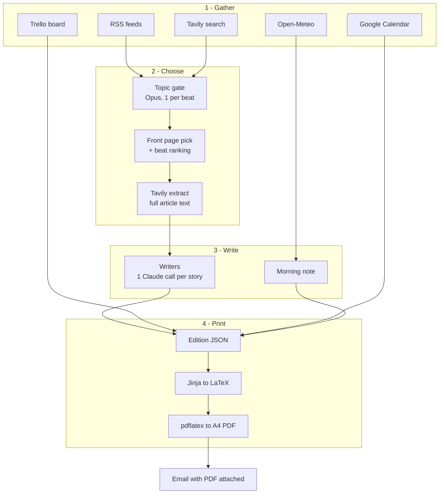
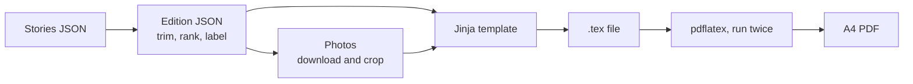

# The Rameen Times — How It Works

*Last updated: 2026-09-20*

The Rameen Times is a program that prints a personal newspaper every morning: it
gathers the day's news, your meetings and your task list, has Claude write the
stories, lays them out as a real newspaper page, and emails you the PDF at 07:00
Karachi time.

This document describes the pipeline **as it actually runs**. `project.md` is the
original specification and still describes an earlier design in places.

---

## How one morning works

One command runs the whole thing, and it always goes in the same order:
**gather, choose, write, print, send**. A single run takes about a minute.



Read it top to bottom: the sources all feed a filtering stage, the survivors get
written up one story at a time, and everything merges into a single JSON file
that becomes the printed page.

The important design choice is that **JSON is the hand-off point**. Every
decision about what goes in the paper is finished before layout begins, and
nothing after that point asks Claude anything. That makes the printing step
repeatable: the same JSON always produces the same PDF, so a layout problem can
be fixed and re-run without spending money on the model or hitting the news
sites again.

---

## The newsroom

The paper is not written by one big prompt. It is written by a small crew of
separate Claude calls, each with one job, one set of instructions, and a fixed
answer shape. A run makes roughly 20 calls.

| Agent | Model | Runs | Its one job |
| --- | --- | --- | --- |
| Query writer | Sonnet | once | Reads your interests file and writes 4 search queries per topic |
| Topic gate | Opus | once per topic | Sees ~40 headlines for one topic, keeps the best 4 |
| Front page pick | Opus | once | Chooses which single story leads the paper |
| Beat ranking | Sonnet | once per topic | Orders the leftovers for each topic |
| Writers | Sonnet | once per story | Rewrites one article in the paper's voice |
| Morning note | Sonnet | once | Writes your personal note from weather, meetings and tasks |

Splitting the work this way buys three things. A failure stays small: if one
writer fails, that story is dropped and the paper still prints. The expensive
model is used only where judgement matters, so **Opus decides what is worth
reading and Sonnet does the writing**. And every call is checked.

That checking is the part worth understanding. Each agent is handed a required
answer shape, and Claude must reply by filling in that form rather than writing
free text. If the reply does not fit the form, the code sends it back once with
the error attached and asks again. If it fails twice, that agent falls back to a
plain non-AI rule, such as "keep the top 4 by source preference". The paper is
never blocked by a model having a bad moment.

One deliberate limit: agents may only choose among stories that the gathering
code actually found. They rank, pick and rewrite, but they cannot introduce a
story, a quote or a source of their own.

The shared code that makes every one of these calls is `src/agents/llm.py`.

---

## Where the news comes from

The paper covers five fixed topics: Palestine, art and crafts, Islamabad
culture, space, and tech and AI. Your taste for each one lives in a plain
English file, `config/user.md`, which you edit by hand. The program only reads
it.

News arrives on two roads at once:

- **RSS feeds** — a fixed list of publications in `config/feeds.json`, newest 5
  items each. Reliable, but only covers outlets already on the list.
- **Tavily search** — a news search API. Claude reads your interests file and
  writes 4 fresh queries per topic each morning, so this road finds things no
  fixed feed would.

That yields roughly 200 candidate headlines. Four filters then cut it to about 20:

1. **Already seen.** Every story printed in the last 45 days is remembered in
   `data/seen.json`, by both link and headline, so the same story cannot appear
   twice under a reworded title.
2. **Blocked sources and keywords.** Dawn and Tribune are dropped as house
   voices. The Islamabad topic additionally drops anything political or
   security-related by keyword, so the culture page stays a culture page.
3. **The topic gate.** Opus sees one topic's surviving headlines and keeps the
   best 4, judged against your interests file.
4. **Photo check.** Stories without a usable picture are weaker candidates, and
   Instagram and Facebook image links are rejected outright because they do not
   load for an outside program.

Only after the cut does the program fetch full articles, using Tavily's extract
endpoint on the ~20 survivors. That ordering is a cost decision: full text is
fetched for the stories that made it, not for the 200 that did not.

The writers work from that extracted text. They are told to rewrite it, never to
paste it, and never to invent a quote, a death toll or a diplomatic development.
Each printed story carries its source name.

---

## Your day: Trello, calendar and weather

The right-hand column of page one is the personal half of the paper. Three
services feed it, and each connects differently.

| Source | How it connects | What it needs |
| --- | --- | --- |
| Trello | REST API, key + token | `TRELLO_API_KEY`, `TRELLO_TOKEN` |
| Google Calendar | Secret iCal link, downloaded as a file | `GOOGLE_ICAL` |
| Weather | Open-Meteo, free, no account | nothing |

**Trello** is read over its normal API. The program finds your board by name,
then sorts its lists into two buckets set in `config/paper.yaml`: lists like
*this week* and *later* become To-do, lists like *today* become In progress.
Matching ignores capitals, so "This Week" and "this week" both work. If no list
names match, it falls back to reading every list rather than printing an empty
box.

**Google Calendar** is deliberately the simplest connection available. Rather
than Google sign-in, it uses the secret iCal link from your calendar settings —
the program downloads one file, no login flow and no token that expires. It then
has to do real calendar work on that file: expanding repeating events into
actual dated ones, honouring end dates, skipping cancelled events, and
converting everything to Karachi time. It shows today and tomorrow.

**Weather** comes from Open-Meteo for Islamabad, which needs no account. The raw
response is large, so the code reduces it to the handful of numbers actually
printed: current temperature, feels-like, humidity, wind, sunrise and sunset,
plus a three-day outlook.

All three are optional by design. **If any one of them fails, the paper still
prints.** A failed service writes a short note in place of its box — "Trello not
connected" — and the run carries on. A missing to-do list should never cost you
the morning's news.

---

## From JSON to a printed paper

The paper is typeset with LaTeX, the same tool used for academic papers and
books. An earlier version tried to send the newspaper as an HTML email; Gmail
clipped it and broke the images. Printing a PDF sidesteps email formatting
entirely.



Four things happen on the way that are worth knowing:

- **Length is capped.** The writers are asked for about 2,000 characters and
  regularly return 3,000. Left alone, sixteen stories ran to fifteen pages.
  Stories are trimmed on whole-paragraph boundaries — lead 2,100 characters,
  secondary 1,500, brief 420 — which never leaves half a sentence. The paper
  lands at four or five pages.
- **Photos are downloaded and cropped by the program**, never linked. Each slot
  has a shape (the front-page photo is wide, the inside ones shallow) and the
  image is cut to fit exactly, so no picture arrives with blank space beside it.
  A photo that fails to download drops its figure rather than failing the paper.
- **Text is made safe for the typesetter.** LaTeX treats characters like `&`,
  `%` and `$` as commands, so they are escaped. More awkwardly, the typesetter
  cannot print emoji or Arabic at all — it stops with an error rather than
  skipping them. A model once put a sun emoji in the morning note and killed the
  whole run. Such characters are now converted where there is a sensible
  equivalent and dropped where there is not, with a line in the log saying what
  was removed.
- **pdflatex runs twice**, because page numbers in the contents box are only
  known after a first pass.

Every run is archived under `editions/YYYY-MM-DD/` — the JSON, the `.tex`, the
PDF and the photos. Because layout is fully repeatable from the JSON, an old
edition can be re-printed at any time without re-fetching anything.

The email itself stays plain: the date, the lead headline, and "paper attached".

---

## What each part of the code does

The project is Python, about 4,000 lines, grouped by the stage it belongs to.

| Folder or file | What it does |
| --- | --- |
| `config/` | The settings you edit: interests, RSS feeds, paper name, Trello list names |
| `src/gather/` | Fetching only: news, Tavily, Trello, calendar, weather, photos |
| `src/agents/` | The Claude calls: queries, gate, front page pick, writers, plus the shared API code |
| `src/render/` | Turning finished stories into a PDF: LaTeX text, photo cropping, pdflatex |
| `src/deliver/` | Gmail, plain note with the PDF attached |
| `src/pipeline.py` | The conductor — runs the stages in order |
| `src/cli.py` | The commands you type |
| `src/models.py` | The shape of every piece of data, and the rules each one must satisfy |
| `src/seen.py` | The 45-day memory that stops repeats |
| `templates/` | The newspaper layout itself |
| `editions/` | One dated folder per day's paper |

Two of these carry more weight than their size suggests.

`src/models.py` defines the shape of everything — what a news story is, what a
meeting is, what a finished edition is. Because Claude's replies are checked
against these shapes, this file is also what stops a malformed answer from
reaching the printed page.

`templates/edition.tex.j2` is the newspaper's visual design: masthead, columns,
photo boxes, the "Your Day" panel. Changing how the paper looks means editing
this one file, not the Python.

---

## Running it

Three commands, and only one of them sends mail:

```
python -m src.cli preview            # build today's paper and open the PDF
python -m src.cli preview --sample   # re-print a saved example, no APIs called
python -m src.cli send               # build it, then email the PDF
```

The `--sample` form is the one to reach for when changing the layout: it prints
from a saved file, so it costs nothing and needs no internet.

Every run writes a full log to `logs/`, including each agent's prompt and reply,
with API keys blanked out. When a paper looks wrong, that log shows which agent
decided what.

**Scheduling.** A systemd timer runs it at 07:00 Karachi time. The timezone is
named in the timer itself, so the paper arrives at 07:00 Karachi regardless of
the machine's own clock setting, and a missed morning (laptop asleep) sends on
the next boot instead of being skipped.

```
cp scripts/rameen-times.{service,timer} ~/.config/systemd/user/
systemctl --user enable --now rameen-times.timer
```

**Requirements.** Python 3.11 or newer, and a LaTeX installation for `pdflatex`
— on Debian or Ubuntu, `texlive-latex-recommended`, `texlive-latex-extra` and
`texlive-fonts-recommended`.

**Keys.** Five secrets live in a `.env` file at the project root, which is
excluded from version control: the Anthropic key, the Tavily key, two Trello
values and the Gmail app password, plus the secret calendar link. Nothing is
hardcoded, and the logs redact them.
